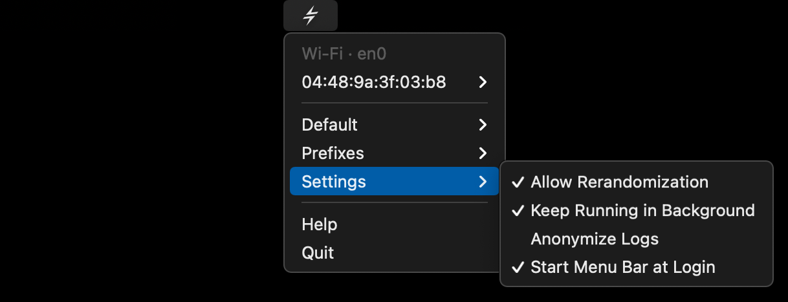

# Settings

Let's look at how you can configure LinkLiar.



## 🕹 Allow Rerandomization

If an interface has been set to "Random", it may still not be random enough for you.
Because keeping a specific address for a year or so, is not really random.

With this setting enabled, LinkLiar will shuffle the MAC address whenever you logout
or put your computer to sleep (e.g. closing the lid).

This way you ensure enough entropy even over a longer period of time.

## 👣 Keep Running in Background

If you quit LinkLiar, it does not really quit.
It is alive at all times and manages your MAC addresses according to what you configured.
This way you can make sure that the MAC addresses even keep random on boot, before you login.

You may disable this setting, so LinkLiar is only active while you can see
the LinkLiar icon in your menu bar.

## 😎 Anonymize Logs

Should you ever find yourself in need to share your log file or a screenshot
of LinkLiar, you might first want to turn on this setting.

It will deterministically change the way it logs and displays the MAC address
so you do not expose your original hardware MAC address.

Don't get confused though if this is turned on. Everything still works normally,
but LinkLiar will tell you one thing while reality is another.

By the way, you can see the logs by typing the following command into your Terminal.

```bash
/Applications/LinkLiar.app/Contents/Resources/logs
```

Assuming that your `LinkLiar.app` is located in `/Applications`.

## ☀️ Start Menu Bar at Login

This option will start the LinkLiar menu bar app when you login to your computer.

Normally you don't need to use this. It is sufficient to activate "Keep Running in Background" so that the background process is on.

Starting the menu bar app is only useful if you want to be warned about MAC leakage by the icon.

 

# Configuring MAC address prefixes for randomization

Most users won't need to worry about this.
But if you hold the Option ⌥ key while the LinkLiar menu is open,
a new menu item will appear, called "Prefixes".


A prefix are the first 6 characters of the MAC address, for example `aa:aa:aa` followed by the suffix `bb:bb:bb`.
Together they make up the MAC address.

Every vendor of network equipment (such as Apple, IBM, etc.) has been allocated one or more prefixes to be used in their products,
such as your MacBook and phone. So, right now, your Wi-Fi card has one of Apple's prefixes, and a unique suffix that nobody else has.

If you instruct LinkLiar to generate a random MAC address for you, it will choose among one of the many prefixes
that Apple uses. But you can change that by adding another vendor, such as Samsung.

But you can also specify one or more prefixes yourself. LinkLiar chooses among all chosen vendors and custom prefixes (simply remove all vendors to force LinkLiar to pick a prefixfrom among your custom prefixes).

## 🍿 That's it!

You're now ready to use LinkLiar.
